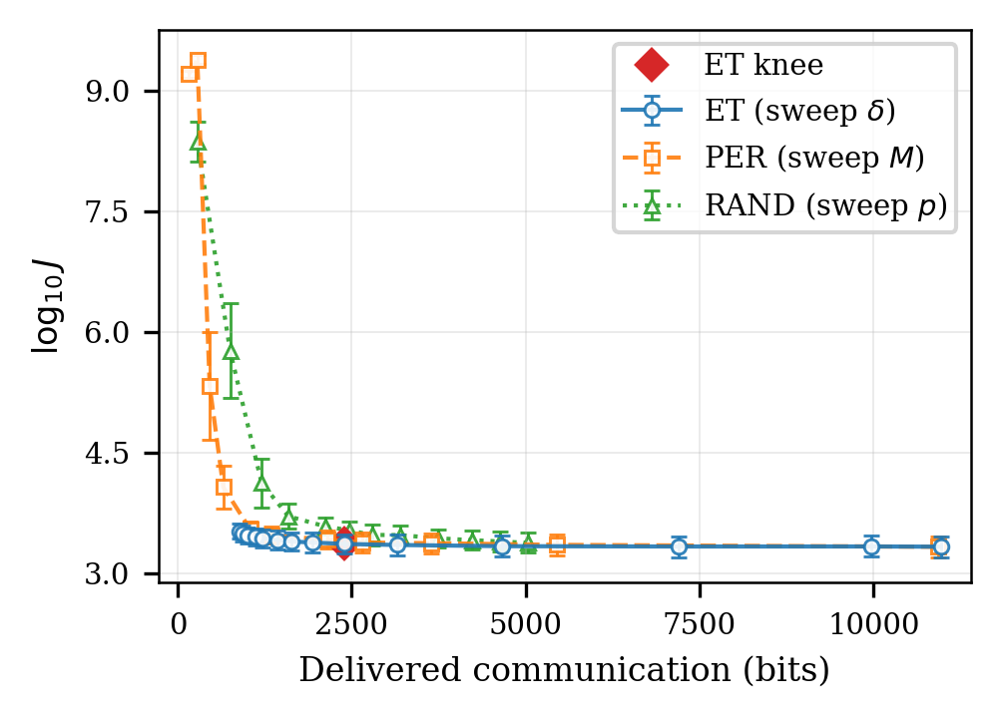
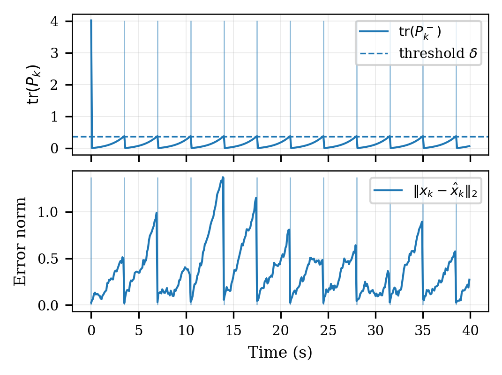

# YAC: Event-Triggered SCC Simulations

This repository contains the simulation code and paper sources for a study of
event-triggered communication in sensing-communication-control (SCC) loops with
intermittent wireless updates. We model a discrete-time LTI system controlled
by a fixed LQR, where state information is delivered via an error-based
event-triggered policy. Intermittent communication induces a grow-and-reset
prediction-error process at the controller, which can be interpreted as a
communication-regulated endogenous input. We establish finite-horizon
input-to-state stability (FT-ISS) bounds that explicitly reveal how the
triggering threshold trades off closed-loop performance and communication usage.
Simulation results in precision agriculture-inspired scenarios confirm clear
Pareto-type trade-offs and robustness under realistic impairments.

## Contents

- `content.tex`: Main paper LaTeX source.
- `src/yac_sim/`: Simulation package used to generate paper figures.
- `run_experiments.py`: Convenience entrypoint for running all experiments.
- `result/`: Generated figures and outputs (ignored by git).

## Quick start (uv)

Initialize the environment and install dependencies:

```bash
uv sync
```

Run all experiments and write figures to `result/`:

```bash
uv run python run_experiments.py --outdir result
```

Quick run (reduced Monte Carlo runs and horizon):

```bash
uv run python run_experiments.py --fast --outdir result
```

You can also run the module directly:

```bash
uv run python -m yac_sim --outdir result
```

## Experiments and figures

The experiments align with the paper and include event-triggered (ET), periodic
(PER), and random (RAND) communication baselines under both idealized and
robust settings. Figures are generated into `result/` as both PNG and PDF.

Figure A: performance-communication Pareto frontier.



Figure B: grow-and-reset prediction-error dynamics with cumulative packets.



Figure C: comparison under matched communication budgets.


Figure D: robustness panel under noise, quantization, loss, and mismatch.


PDF versions are in `result/` with the same base filenames (e.g.,
`result/fig_A_pareto_tradeoff.pdf`).
